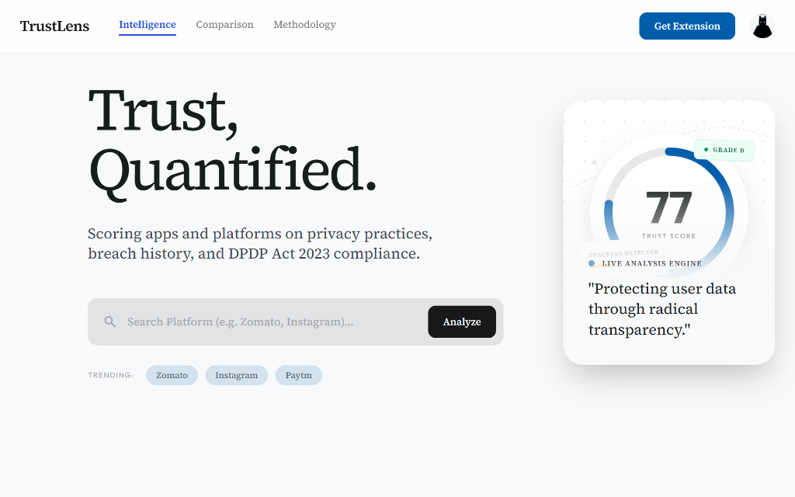

# TrustLens

**Trust, Quantified.**

TrustLens is a comprehensive platform for scoring India's top apps and platforms on privacy practices, breach history, and DPDP Act 2023 compliance. It provides editorial-grade veracity audits and transparent privacy scores for the most influential digital platforms.



## Overview

In an age of synthetic certainty, TrustLens cuts through the noise to provide a **Live Analysis Engine** that protects user data through radical transparency. 

Every platform is audited across 5 core signals:
- **Privacy Policy** (20 pts)
- **Breach History** (30 pts)
- **Compliance** (20 pts)
- **Complaints** (15 pts)
- **Trackers** (15 pts)

Scores translate to standard grades (A-F) indicating trustworthiness and DPDP Act 2023 compliance.

## Project Structure

- **frontend/**: React, TypeScript, TailwindCSS, and Vite. Includes modular components like `ScoreCard`, `CompareView`, `MethodologyView`, and `ExtensionMockupView`.
- **backend/**: FastAPI and Python. Powered by an intelligent `scoring_engine.py` and a `demo_data.py` database mapping real-world platforms to dynamic privacy scores.

## Running Locally

1. **Start the Backend:**
   ```bash
   cd backend
   pip install -r requirements.txt
   uvicorn main:app --reload
   ```

2. **Start the Frontend:**
   ```bash
   cd frontend
   npm install
   npm run dev
   ```

3. Open `http://localhost:5173` in your browser.
