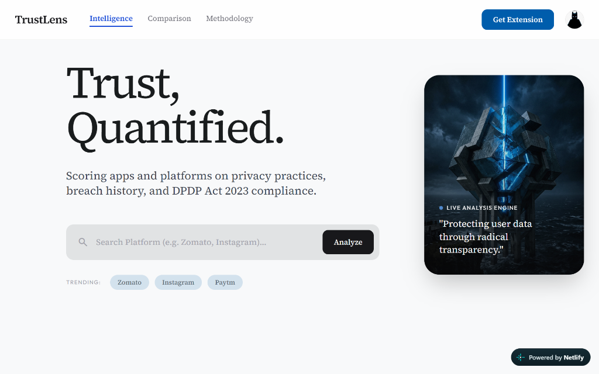

# TrustLens

> **Trust, Quantified.**

TrustLens is an editorial-grade trust and privacy auditing platform for India's digital ecosystem. It scores applications and platforms on privacy practices, breach history, and DPDP Act 2023 compliance through radical transparency.

---

### 🌐 Live Demo & Deployment

<div align="center">
  <a href="https://trusttlens.netlify.app" target="_blank">
    
  </a>
  &nbsp;
  <a href="https://trustlens-qtex.onrender.com" target="_blank">
    
  </a>
  &nbsp;
  <a href="https://trustlens-qtex.onrender.com/score?platform=zomato" target="_blank">
    
  </a>
</div>

- **Frontend Application:** <a href="https://trusttlens.netlify.app" target="_blank" rel="noopener noreferrer">https://trusttlens.netlify.app</a>
- **Backend API Service:** <a href="https://trustlens-qtex.onrender.com" target="_blank" rel="noopener noreferrer">https://trustlens-qtex.onrender.com</a>
- **Interactive JSON Endpoint:** <a href="https://trustlens-qtex.onrender.com/score?platform=zomato" target="_blank" rel="noopener noreferrer"><code>/score?platform=zomato</code></a>

---



---

## 🎯 What TrustLens Does

In an age of synthetic certainty, TrustLens evaluates digital platforms using **5 independent veracity signals**:

| Signal | Weight | Description |
| :--- | :--- | :--- |
| **Breach History** | **30 pts** | Incident severity, transparency, and remediation speed. |
| **Privacy Policy** | **20 pts** | Clarity, data retention caps, third-party sharing, and user rights. |
| **DPDP Compliance** | **20 pts** | Alignment with India's Digital Personal Data Protection Act 2023. |
| **Tracker Detection** | **15 pts** | Volume and intrusiveness of hidden third-party tracking scripts. |
| **Consumer Complaints**| **15 pts** | Volume and resolution rate of verified consumer privacy complaints. |

Total scores (0–100) map to intuitive letter grades (**Grade A** to **Grade F**) with clear, actionable advice for users.

---

## 🚀 Key Features

- **Platform Intelligence:** Instant deep-dive audits for popular platforms (Zomato, Swiggy, Instagram, Paytm, etc.).
- **Comparison Mode:** Side-by-side veracity analysis highlighting which platform better protects your data.
- **Methodology & Transparency:** Tamper-proof scoring model derived from 80% independently verifiable data signals.
- **Chrome Extension Concept:** Quick-audit mini scorecard preview embedded within the application.

---

## 🛠️ Tech Stack

- **Frontend:** React 18, TypeScript, Vite, TailwindCSS, React Router
- **Backend:** Python 3.11, FastAPI, Uvicorn, SQLite Cache Manager
- **Deployment:** Netlify (Frontend CDN) + Render (Cloud Web Service)

---

## 💻 Running Locally

### 1. Start the Backend
```bash
cd backend
pip install -r requirements.txt
uvicorn main:app --reload --port 8000
```

### 2. Start the Frontend
```bash
cd frontend
npm install
npm run dev
```

Open [http://localhost:5173](http://localhost:5173) in your browser.
